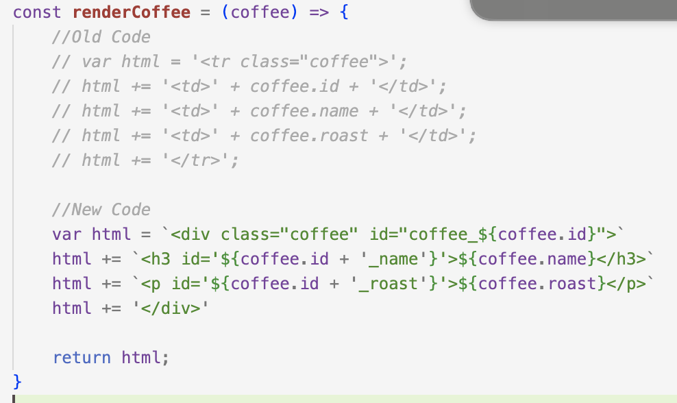
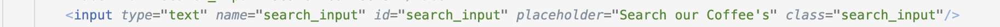
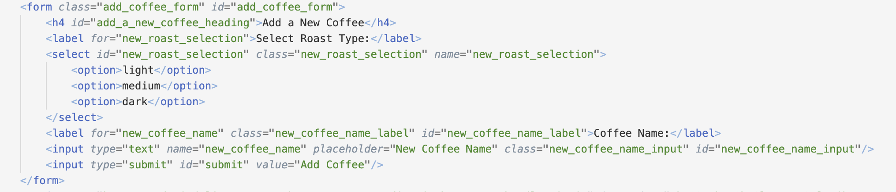

# Coffee Elements

## Element structure

1. <strong>class</strong> : .coffee
2. <strong>id</strong> : #coffee_[coffee.id]  

# Search input

## Element structure

1. <strong>class</strong> : .search_input
2. <strong>id</strong> : #search_input

# Add Coffee form

## Element structure

